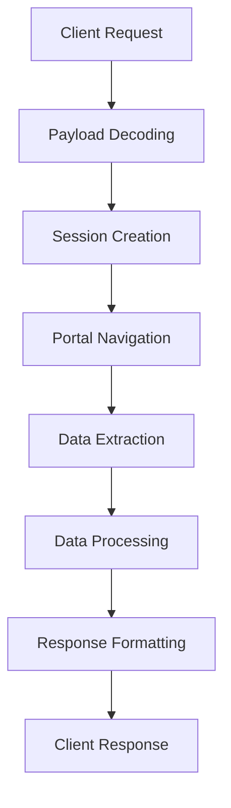

# NIMORA API Server

A comprehensive FastAPI-based backend service for scraping and processing academic data from PSG Tech's eCampus portal. The server provides secure, RESTful endpoints for accessing student attendance, CGPA, internal marks, exam schedules, and automated feedback submission.

## 🏗️ Architecture Overview

### Core Components

```
nimora-server/
├── app.py                 # Main FastAPI application
├── requirements.txt       # Python dependencies
├── vercel.json           # Vercel deployment configuration
├── util/                 # Utility modules
│   ├── HomePage.py       # Authentication & session management
│   ├── Attendance.py     # Attendance data processing
│   ├── Cgpa.py          # CGPA calculation & processing
│   ├── Internals.py     # Internal marks scraping
│   ├── Timetable.py     # Exam schedule extraction
│   └── Feedback.py      # Automated feedback system
└── debug/               # Debug utilities
```

## 🔐 Security Architecture

### Payload Security System

The server implements a multi-layer security system for credential protection:

```python
class PayloadSecurity:
    # Layer 1: Base64 encoding
    # Layer 2: Salt addition + string reversal
    # Layer 3: JSON serialization
    # Layer 4: Final Base64 encoding
```

**Security Flow:**
1. Client encodes credentials with salt and reversal
2. Server decodes through multiple layers
3. Credentials are used only for session creation
4. No sensitive data is stored or logged

### Request/Response Logging

Clean, privacy-focused logging system:

```python
# Only logs API hits, no sensitive data
logger.info(f"Sending Request to the Target: {method} {path}")
logger.info(f"Received Response from the Target: {status} {path}")
```

## 📡 API Endpoints

### Core Endpoints

| Endpoint | Method | Description | Authentication |
|----------|--------|-------------|----------------|
| `/` | GET | API information | None |
| `/health` | GET | Health check | None |
| `/login` | POST | Authentication & attendance summary | Required |
| `/attendance` | POST | Detailed attendance data | Required |
| `/cgpa` | POST | CGPA & semester GPA | Required |
| `/internals` | POST | Internal assessment marks | Required |
| `/exam-schedule` | POST | Upcoming exam schedule | Required |
| `/auto-feedback` | POST | Automated feedback submission | Required |
| `/user-info` | POST | User profile information | Required |

### Request Format

The API supports two authentication formats:

#### 1. Encoded Payload (Recommended)
```json
{
  "data": "base64_encoded_payload"
}
```

#### 2. Legacy Format (Backward Compatible)
```json
{
  "rollno": "student_roll_number",
  "password": "student_password"
}
```

### Response Format

All endpoints return standardized JSON responses:

```json
{
  "success_response": {
    "data": [...],
    "message": "Operation completed successfully"
  },
  "error_response": {
    "detail": "Error description",
    "error_type": "ExceptionType"
  }
}
```

## 🛠️ Utility Modules

### 1. HomePage Module (`util/HomePage.py`)

**Purpose:** Handles authentication and session management

**Key Functions:**
- `getHomePageAttendance()` - Creates session for attendance portal
- `getHomePageCGPA()` - Creates session for CGPA portal

**Features:**
- Dynamic token extraction from login forms
- Multi-portal support (studzone vs studzone2)
- Session validation and error handling

### 2. Attendance Module (`util/Attendance.py`)

**Purpose:** Processes attendance data and calculates statistics

**Key Functions:**
- `getStudentAttendance()` - Scrapes attendance table
- `getCourseNames()` - Maps course codes to names
- `getAffordableLeaves()` - Calculates bunking capacity
- `calculateLeaves()` - Individual course leave calculation

**Data Processing:**
```python
# Raw data structure
[
  ["CS101", "45", "2", "0", "43", "95.56"],
  ["MA101", "30", "1", "0", "29", "96.67"]
]

# Processed structure
{
  "course_code": "CS101 - COMP",
  "total_classes": 45,
  "present": 43,
  "absent": 2,
  "percentage": "95.56%",
  "affordable_leaves": 5
}
```

### 3. CGPA Module (`util/Cgpa.py`)

**Purpose:** Calculates CGPA and processes academic records

**Key Functions:**
- `getStudentCourses()` - Scrapes course completion data
- `getCompletedSemester()` - Extracts semester information
- `getCGPA()` - Calculates cumulative GPA

**CGPA Calculation:**
```python
# Grade to GPA mapping
grade_map = {
    'O': 10.0, 'A+': 9.0, 'A': 8.0,
    'B+': 7.0, 'B': 6.0, 'C': 5.0,
    'U': 0.0, 'W': 0.0, 'I': 0.0
}

# CGPA = Σ(credit × GPA) / Σ(credit)
```

### 4. Internals Module (`util/Internals.py`)

**Purpose:** Scrapes and processes internal assessment marks

**Key Functions:**
- `getInternals()` - Extracts internal marks table
- `getTargetScore()` - Calculates target scores for finals
- `calculateTarget()` - Individual target calculation

**Data Structure:**
```python
# Raw internal marks
[
  ["CS101", "45", "42", "48", "35", "40", "45", "88", "42"],
  ["MA101", "48", "45", "50", "38", "42", "46", "92", "45"]
]

# Processed structure
{
  "course_code": "CS101 - COMP",
  "test1": "45",
  "test2": "42",
  "final_50": "88",
  "final_40": "42",
  "total": 175,
  "status": "Excellent"
}
```

### 5. Timetable Module (`util/Timetable.py`)

**Purpose:** Extracts exam schedule information

**Key Functions:**
- `getExamSchedule()` - Scrapes exam timetable
- Date/time parsing and validation
- Course mapping integration

### 6. Feedback Module (`util/Feedback.py`)

**Purpose:** Automated feedback submission system

**Key Functions:**
- `auto_feedback_task()` - Background feedback submission
- Selenium WebDriver integration
- Multi-browser support with fallbacks

## 🔄 Data Flow Architecture

### Authentication Flow



### Scraping Pipeline

1. **Session Management**
   - Dynamic token extraction
   - Form data preparation
   - Authentication validation

2. **Data Extraction**
   - HTML parsing with BeautifulSoup
   - Table structure identification
   - Content extraction and cleaning

3. **Data Processing**
   - Type conversion and validation
   - Business logic application
   - Statistical calculations

4. **Response Formatting**
   - JSON serialization
   - Error handling
   - Consistent response structure

## 🚀 Deployment

### Vercel Deployment

The server is configured for serverless deployment on Vercel:

```json
{
  "version": 2,
  "builds": [
    {
      "src": "app.py",
      "use": "@vercel/python",
      "config": {
        "maxLambdaSize": "50mb"
      }
    }
  ],
  "routes": [
    {
      "src": "/(.*)",
      "dest": "app.py"
    }
  ]
}
```

### Environment Variables

```bash
# Security
PAYLOAD_SALT=nimora_secure_payload_2025

# Logging
LOG_LEVEL=WARNING  # Production
LOG_LEVEL=INFO     # Development

# Deployment
VERCEL_ENV=production
```

## 📊 Performance Considerations

### Optimization Strategies

1. **Session Reuse**
   - Single session for multiple operations
   - Cookie persistence across requests
   - Connection pooling

2. **Caching Strategy**
   - No server-side caching (stateless design)
   - Client-side caching recommended
   - Fresh data on each request

3. **Error Handling**
   - Graceful degradation
   - Comprehensive error logging
   - User-friendly error messages

### Rate Limiting

- No explicit rate limiting implemented
- Relies on Vercel's built-in protections
- Consider implementing for production use

## 🔧 Development Setup

### Local Development

```bash
# Clone repository
git clone https://github.com/duvarakeshss/Nimora.git
cd Nimora/server

# Create virtual environment
python -m venv venv
source venv/bin/activate  # Windows: venv\Scripts\activate

# Install dependencies
pip install -r requirements.txt

# Run development server
uvicorn app:app --reload --host 0.0.0.0 --port 8000
```

### Testing

```bash
# Run API tests
python test_scraping_local.py

# Health check
curl http://localhost:8000/health
```

## 📈 Monitoring & Logging

### Log Levels

- **INFO**: API hits and successful operations
- **WARNING**: Non-critical issues
- **ERROR**: Failures and exceptions

### Log Format

```
INFO: Sending Request to the Target: POST /attendance
INFO: Received Response from the Target: 200 /attendance
ERROR: Request failed: POST /login - Invalid credentials
```

## 🛡️ Security Best Practices

### Implemented Security Measures

1. **Credential Protection**
   - Multi-layer encoding/decoding
   - No credential storage
   - Session-based authentication

2. **Input Validation**
   - Request parameter validation
   - Type checking and sanitization
   - Error message sanitization

3. **Logging Security**
   - No sensitive data in logs
   - Clean request/response tracking
   - Error message filtering

### Security Considerations

- **HTTPS Only**: All communications should use HTTPS
- **Rate Limiting**: Implement appropriate rate limiting
- **Input Sanitization**: Validate all user inputs
- **Error Handling**: Don't expose internal system details

## 🔄 API Versioning

The API uses URL-based versioning for future compatibility:

```
/v1/login
/v1/attendance
/v1/cgpa
```

## 📚 Dependencies

### Core Dependencies

```txt
fastapi>=0.68.0        # Web framework
uvicorn>=0.15.0        # ASGI server
pydantic>=1.8.0        # Data validation
requests>=2.25.0       # HTTP client
beautifulsoup4>=4.9.0  # HTML parsing
pandas>=1.3.0          # Data processing
selenium>=4.0.0        # Browser automation
webdriver-manager>=3.5.0 # WebDriver management
```

### Development Dependencies

```txt
python-dotenv>=0.19.0  # Environment variables
lxml>=4.6.0           # XML/HTML parser
pytz>=2021.1          # Timezone handling
httpx>=0.20.0         # Async HTTP client
```

## 🤝 Contributing

### Code Structure Guidelines

1. **Modular Design**: Keep utility functions in separate modules
2. **Error Handling**: Implement comprehensive error handling
3. **Logging**: Use appropriate log levels, no sensitive data
4. **Documentation**: Document all functions and classes
5. **Testing**: Add tests for new functionality

### Development Workflow

1. Create feature branch
2. Implement changes with proper error handling
3. Test locally with various scenarios
4. Update documentation
5. Submit pull request

## 📄 License

This project is licensed under the MIT License - see the LICENSE file for details.

## 👥 Support

For support and questions:
- Create an issue on GitHub
- Check the API documentation at `/docs`
- Review the health endpoint at `/health`

---

**Built with ❤️ for PSG Tech students**</content>
<parameter name="filePath">d:\Repos\Nimora\server\README.md